<div align="center">





<br/>


<br/>

**`Engineering software with specifications first.`**

</div>

---

## ⚡ Boot Sequence

<div align="center">
  
</div>

---

## 👤 whoami

```ts
const ehsan: Developer = {
  name:       "Muhammad Ehsan",
  handle:     "ehsah-2k4",
  role:       "Full Stack Developer",
  location:   "Pakistan 🇵🇰",
  languages:  ["JavaScript", "TypeScript", "Python"],
  stack:      ["Next.js", "Node.js"],
  theme:      "Purple Neon",
  philosophy: "Where every feature begins with a specification.",
};
```

> I don't start with code. I start with a **spec** — the contract that makes a system
> predictable before a single line exists. Everything in this profile is built that way,
> including this profile.

---

## 🧰 Stack

<div align="center">


</div>

---

## 🛰️ Mission Control

<div align="center">
  
</div>

<div align="center">

<!-- Replace ehsah-2k4 if your GitHub handle differs -->


<br/>


</div>

---

## 🖥️ Terminal

<div align="center">
  
</div>

<details>
<summary><b>🔓 <code>visitor@spec-os:~$ unlock</code></b> &nbsp;— <i>don't click this</i></summary>

<br/>

```
ACCESS GRANTED

Welcome, curious developer.

You found the hidden room.

:)
```

You read the source. That's the whole test — and you passed.
Here's the secret: **the spec is the product.** Code is just the build artifact.

If you got this far, open an issue titled `hidden-room` and say hi. 💜

</details>

---

## 📦 Featured

<table>
<tr>
<td width="50%" valign="top">

### ⭐ Portfolio
`FEATURED`

Personal portfolio engineered spec-first — purple neon system, motion-aware, fully typed.

`Next.js` · `TypeScript` · `Tailwind`

[**→ Repository**](https://github.com/ehsah-2k4/portfolio)

</td>
<td width="50%" valign="top">

### 🧠 SPEC OS
`SPEC-001`

The design system + profile OS you're reading right now. Docs, tokens, animated SVGs.

`SVG` · `Design System` · `Docs`

[**→ Specification**](./SPECS.md)

</td>
</tr>
</table>

---

## 📖 The Registry

| Document | Purpose |
|----------|---------|
| [`DESIGN_SYSTEM.md`](./DESIGN_SYSTEM.md) | 🎨 The DNA — colors, type, motion, SVG rules |
| [`ABOUT.md`](./ABOUT.md) | 👤 Who's behind the terminal |
| [`MANIFESTO.md`](./MANIFESTO.md) | 📜 Why spec-driven |
| [`SPECS.md`](./SPECS.md) | 🧾 Spec registry |
| [`PROJECTS.md`](./PROJECTS.md) | 📦 Shipped systems |
| [`ROADMAP.md`](./ROADMAP.md) | 🚀 Sprints 1 → 4 |
| [`COMMANDS.md`](./COMMANDS.md) | ⌨️ Terminal reference |
| [`CHANGELOG.md`](./CHANGELOG.md) | 🕓 Version history |

---

## 📡 Channels

<div align="center">

[](https://github.com/ehsah-2k4)
[](https://linkedin.com/in/)
[](mailto:)

</div>

---

<div align="center">


<br/><br/>

`🟢 SYSTEM ONLINE` · `SPEC OS v1.0` · `© 2026 Muhammad Ehsan`

**Predictable systems. Intentional architecture.**

</div>
